# Geistesblitz — Enterprise Idea Management Platform

A multi-tenant, license-gated platform where employees submit innovation ideas, vote on them, route them through a configurable evaluation workflow, and discover related work via RAG + semantic search.

> **Status**: Working prototype. End-to-end functional, German-only UI and seed data; replace mock providers and tighten security before production use.

---

## Screenshots

Captured from the running app against the seeded demo data (FOM tenant, teal `#239F91` brand). The shots below are woven into the feature sections that follow; the **complete gallery (23 images, light + dark)** lives in [`docs/screenshots/`](docs/screenshots/README.md).

| Dashboard | Idea list |
|-----------|-----------|
| 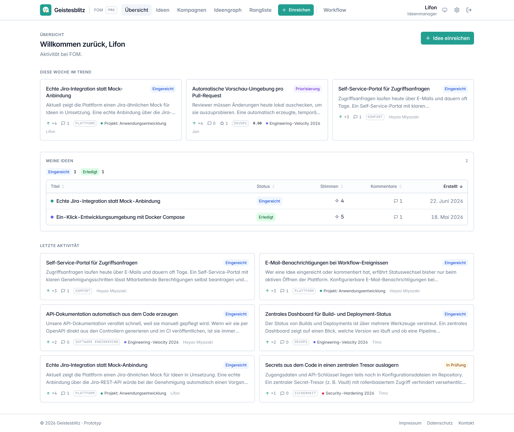 | 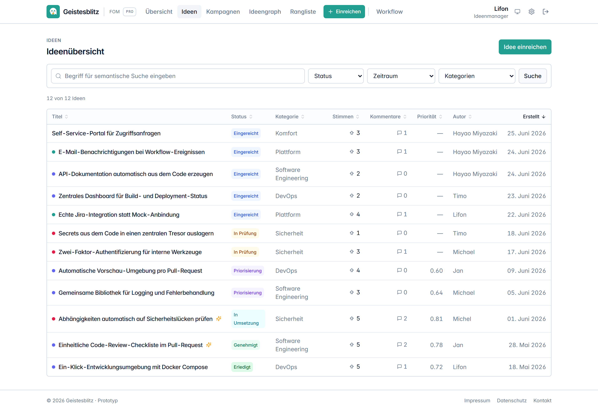 |

*The two primary views: the personal dashboard (trends, task board, own ideas) and the filterable, sortable idea list.*

---

## Stack

| Layer            | Choice                                                                            |
|------------------|-----------------------------------------------------------------------------------|
| Frontend         | React 18 + TypeScript, Vite 5, Tailwind (class-based dark mode), React Router, Zustand (persisted), TanStack Query |
| Backend          | Spring Boot 3.3 (Java 21), Spring Security, Spring Data JPA, Flyway, Spring AOP   |
| Primary DB       | PostgreSQL 16 + `pgvector` (cosine similarity via `<=>`)                          |
| Alternative DB   | Supabase (PostgREST), switched via Spring profile `supabase`                      |
| Auth             | JWT (HS384) with a **mock Keycloak introspection adapter**                        |
| Embeddings       | Pluggable `EmbeddingProvider`: **Ollama** (default, free, `bge-m3` 1024d multilingual) → OpenAI → Mock |
| LLM (refine + chat) | Same `EmbeddingProvider` interface — Ollama `qwen3.5:2b-q4_K_M` by default     |
| Tenancy          | Per-row `tenant_id`; 3-layer isolation: `TenantContext` → Hibernate filter (all entities) → Postgres RLS |
| Licensing        | `Plan` (Free / Pro / Enterprise) with seat caps, idea quotas, feature flags, self-service upgrade |
| Localization     | German-only. UI and all content are German; no i18n layer or per-request language negotiation |

---

## Features

### Role model
Six roles, each with distinct UI surface and API permissions:

| Role                 | Can do                                                                 |
|----------------------|------------------------------------------------------------------------|
| `EMPLOYEE`           | Submit (incl. suggesting a preferred reviewer / idea manager), comment, vote |
| `REVIEWER`           | All of EMPLOYEE + score ideas on Impact / Feasibility / Strategic Fit, claim open reviews |
| `IDEA_MANAGER` | Move stages (incl. approve at Prioritization), assign reviewers & idea managers, manage campaigns, run AI refine + chat |
| `SPONSOR`            | Approve/reject at PRIORITIZATION, toggle sponsor boost                 |
| `ADMIN`              | Manage users, see license usage, all of the above within tenant        |
| `SUPERADMIN`         | Cross-tenant (vendor staff)                                            |

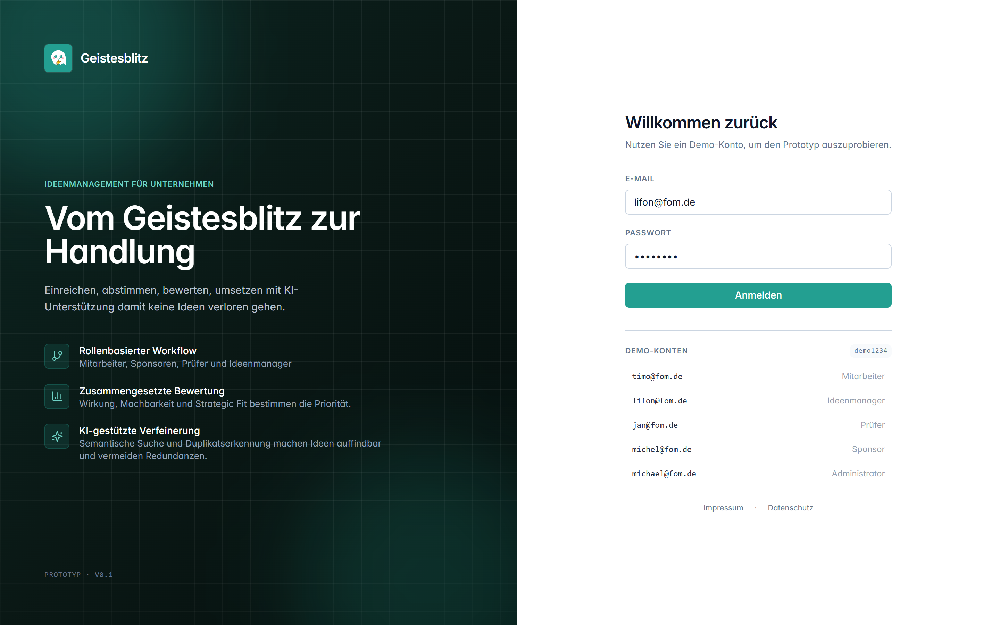
*Login with a one-click demo-account picker for each role.*

### Workflow state machine
```
SUBMITTED → UNDER_REVIEW → PRIORITIZATION → APPROVED → IN_IMPLEMENTATION → DONE
                                  ↘ REJECTED / ARCHIVED
```
Declared in [`IdeaWorkflow.java`](backend/src/main/java/com/ideaplatform/api/workflow/IdeaWorkflow.java). Every transition is gated by (from-stage, to-stage, actor-role) **server-side**. `PRIORITIZATION` requires at least one reviewer evaluation.

The **Workflow page is a Jira/Trello-style Kanban board**: one column per stage, cards are draggable, and while dragging only the columns the current user is actually allowed to move the card into light up (the rest dim). Drops do an optimistic move and roll back with a toast if the server rejects them. The board route is itself role-gated — `EMPLOYEE`s don't see it (the backend stays the source of truth either way).

**Delivery hand-off (mock Jira).** Once an idea reaches `IN_IMPLEMENTATION` (or `DONE`), its detail page shows an *Umsetzung* card with the idea's own reference key (e.g. `GEIST-7`, see *Reference IDs* below) and an **In Jira öffnen** button. It opens a full-screen, Atlassian-styled issue view (`/jira/:id`) rendered entirely from the idea's own data — status, sprint, story points, reporter, comments. It's a self-contained frontend mock (no external Jira instance), so the demo can show the round-trip from idea to delivery ticket without leaving the app.

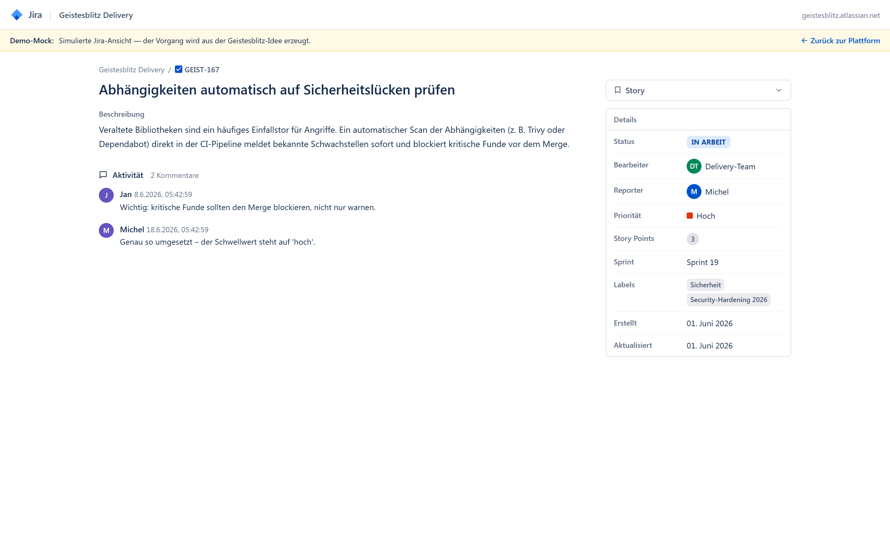
*Mock Jira issue — generated from the idea's data (status, sprint, story points, reporter, comments).*

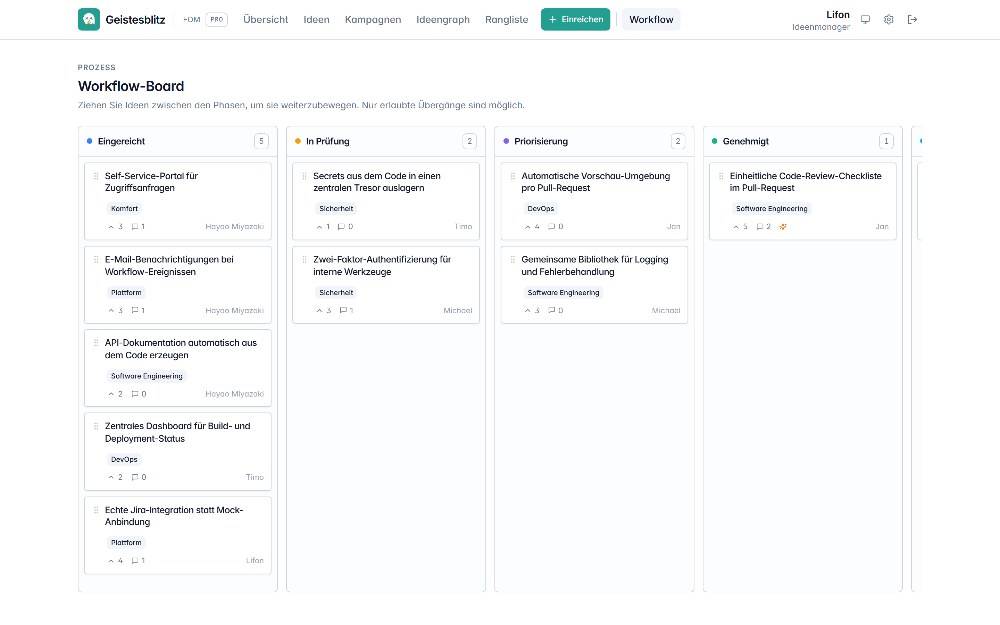
*Workflow board — one column per stage; only legal drop targets light up while a card is dragged.*

### Reference IDs
Every idea carries a **Jira-style reference key** — a per-tenant sequential number rendered as `GEIST-1`, `GEIST-2`, … — shown on the idea list, detail header, cards and the dashboard. It's assigned at creation time (`MAX(reference)+1` per tenant; backfilled by [`V22`](backend/src/main/resources/db/migration/V22__idea_reference.sql), unique per tenant) and is the **same key the mock Jira hand-off uses**, so an idea and its delivery ticket share one identifier.

### Assignment pipeline
Every idea can be assigned to a **reviewer** and an **idea manager**, with a two-step "suggest → assign" flow:

- **Preferred (suggested) assignees, set up front.** On the submit form anyone can pick a *gewünschter Prüfer* and *gewünschter Ideenmanager* (both optional). These are non-binding hints stored as `preferred_reviewer_id` / `preferred_manager_id`; the picker is validated server-side so a submitter can't suggest someone whose role can't fill the slot.
- **Binding assignment.** On the idea detail page a *Zuständigkeit* card lets an `IDEA_MANAGER` / `ADMIN` set or clear the actual `assigned_reviewer_id` / `assigned_manager_id` (a one-click *Vorschlag übernehmen* promotes a suggestion). Reviewers and idea managers can also **claim** an open slot themselves (`POST /api/ideas/{id}/claim?as=reviewer|manager`) — the path for accepting a suggestion.
- **Personal task board.** The dashboard shows a **Meine Aufgaben** card for reviewers and idea managers (side by side with *Meine Ideen*), split into *Mir zugewiesen* (binding) and *Für mich vorgeschlagen* (an open slot they were suggested for, with an inline claim button). Backed by `GET /api/ideas/my-tasks`.
- **Server-side gating.** Assignment (`PATCH /api/ideas/{id}/assignment`) is `@PreAuthorize`-restricted to idea managers/admins; claiming is restricted to roles that can actually fill the slot — both return **403** otherwise. Slots are `ON DELETE SET NULL`, so removing a user just frees the assignment. Schema + demo seed: [`V21`](backend/src/main/resources/db/migration/V21__idea_assignment.sql).

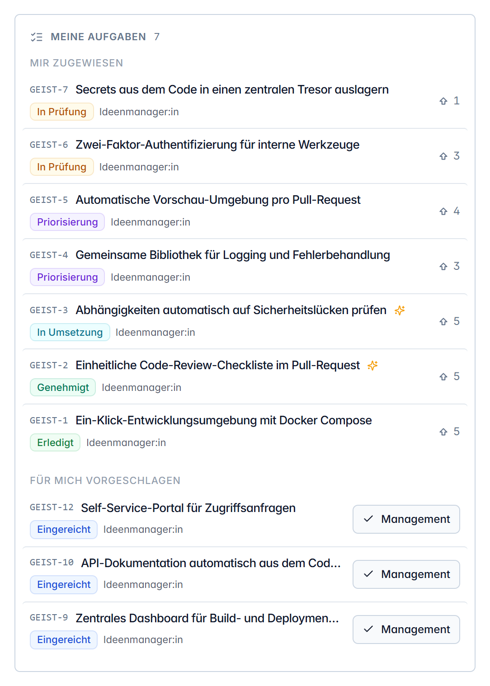
*Dashboard task board — ideas assigned to the idea manager, plus suggestions awaiting a one-click claim.*

### Composite priority scoring
```
score = 0.40 · sigmoid(net_votes / 5)
      + 0.35 · (avg_reviewer_score / 5)
      + 0.15 · 0.5^(age_days / half_life_days)
      + 0.10 · sponsor_boost
```
Weights live in `application.yml`; per-tenant overrides are an obvious next step.

**Transparent in the UI.** The idea detail page renders a *Priorität* breakdown that mirrors this formula: each factor (Stimmen, Prüferbewertung, Aktualität, Sponsor-Förderung) shows its normalized value (0–1 bar), its weight, and its weighted contribution, summing to the composite — plus a one-line explanation of the formula. It's visible to every role, so the ranking is never an opaque number. The reviewer evaluation panel likewise shows how each average is formed `(Wirkung + Machbarkeit + Strategische Passung) / 3`, a live average of the current selection, and the combined reviewer average with a note that it feeds 35 % of the priority. *(The breakdown is computed client-side from the same inputs/weights; keep `PRIORITY_WEIGHTS` in `IdeaDetail.tsx` in sync with `ideaplatform.scoring.*` if the backend weights change.)*

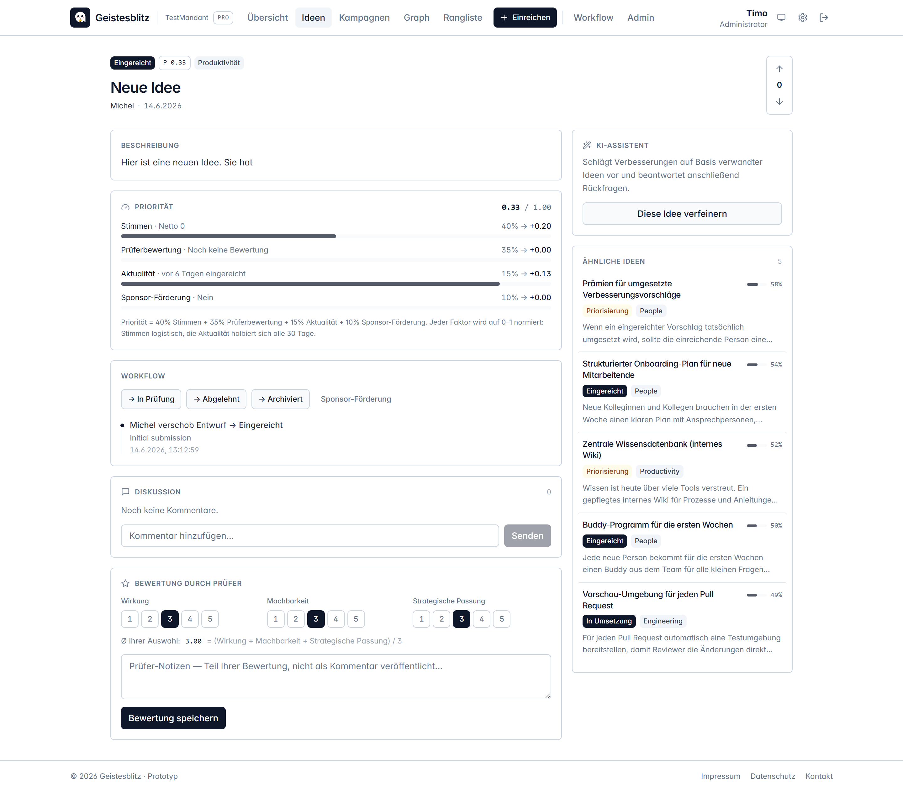
*Idea detail — transparent priority breakdown, voting, reviewer evaluation, comments, and a similar-ideas sidebar.*

### Voting & evaluation
- Idempotent up/down voting (`+1`, `-1`, or `0` to clear).
- Reviewers rate ideas 1–5 on **Impact**, **Feasibility**, **Strategic Fit**; `average = (i+f+s)/3`.
- Both inputs feed back into the priority score on each change.

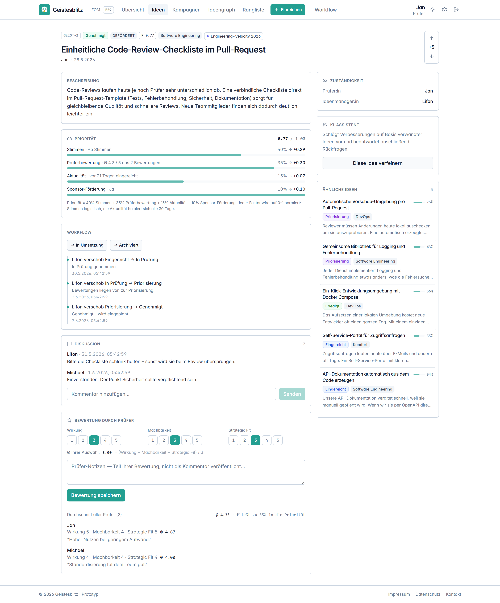
*Idea detail as a reviewer — up/down voting (top-right) and the Wirkung / Machbarkeit / strategische-Passung evaluation panel.*

### RAG & semantic search
- On every create/edit, title + description is embedded by the configured provider and stored as `vector(1024)` in `idea_embeddings`. The default model is **`bge-m3`** — multilingual, with strong German separation (it replaced `nomic-embed-text`, whose English-primary training compressed German topics into a narrow score band and hurt ranking on the German-canonical corpus).
- **Prefix-aware embeddings.** The document path prepends `search_document: ` and the query path prepends `search_query: ` so the two live in comparable regions of the space. The `EmbeddingProvider` interface exposes `embed()` for stored content and `embedQuery()` for free-text searches; OpenAI and Mock providers leave `embedQuery` as the default delegation.
- **Top-k similar ideas** sidebar on the idea detail page (cosine, threshold `0.45` for the sidebar — tuned for "highly similar" against bge-m3's score distribution).
- **Free-text semantic search** on the ideas list page — type a concept, get ranked semantic matches. Uses a lower threshold (`0.30`) than the sidebar so reasonable matches surface even for short queries.
- **Visibility-filtered results.** Both the similar-ideas sidebar and free-text search exclude `REJECTED` and `ARCHIVED` ideas at the SQL layer, so retired ideas don't surface in semantic results.
- **AI refine** button (gated by the `rag_refine` plan feature) retrieves the top-k siblings and asks the LLM for sharpening suggestions, duplicate detection, and a rationale.
- **Refine chat** — multi-turn follow-ups on the same idea, with the same RAG context kept in the prompt and conversation history passed back on every turn.
- **Semantic graph view** of all visible ideas: nodes are ideas, edges are pairs above the chosen threshold, and connected components are colored as clusters (convex hulls drawn via Andrew's monotone-chain algorithm). Drag-aware so panning the graph doesn't accidentally navigate.

| Submit — live duplicate check | Free-text semantic search |
|-------------------------------|---------------------------|
| 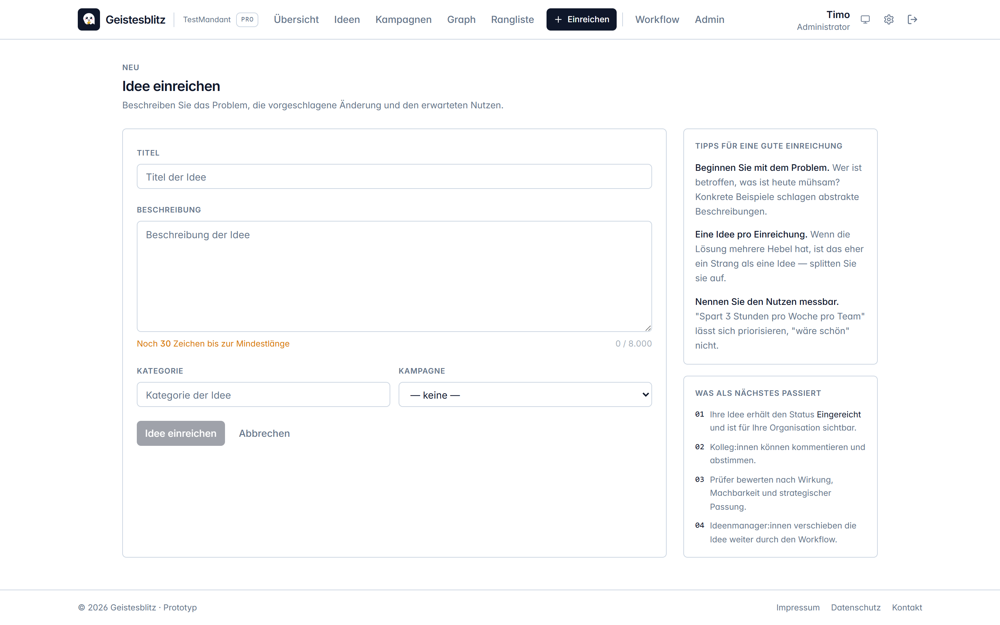 | 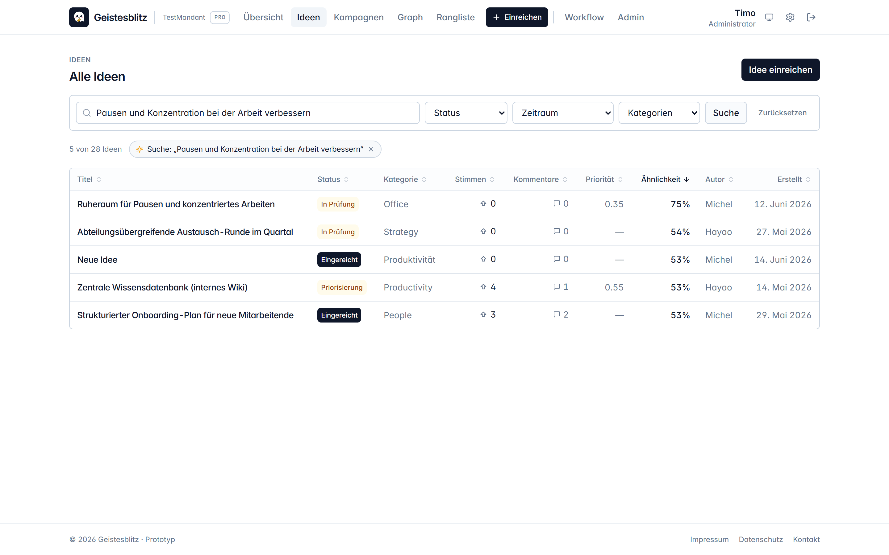 |

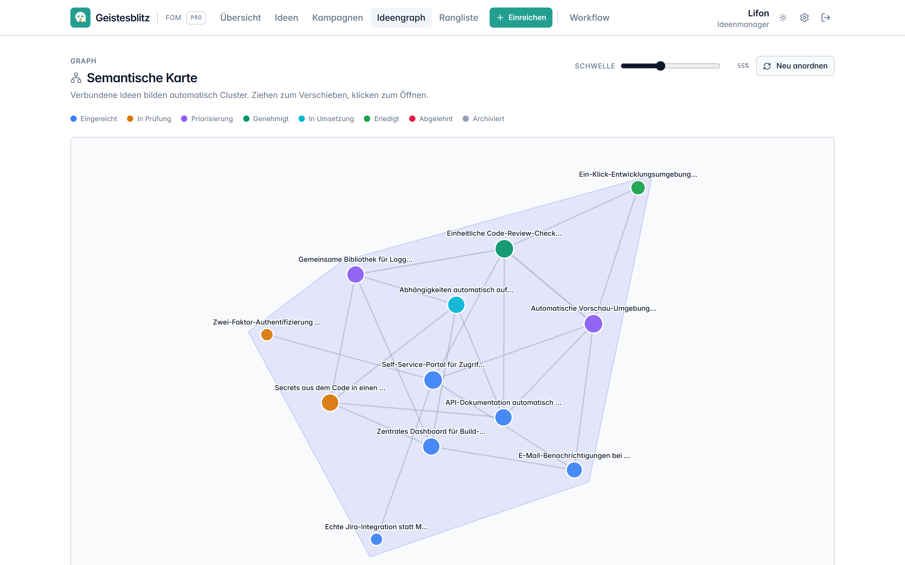
*Semantic map — ideas as nodes, similarity edges, and colored clusters of related work (cosine similarity).*

### Campaigns
- `IDEA_MANAGER` / `ADMIN` group ideas around a theme, deadline, or strategic initiative.
- Employees can attach a new idea to a campaign at submit time (or from a campaign's detail page).
- Deleting a campaign sets each linked idea's `campaign_id` to `NULL` via the `ON DELETE SET NULL` FK — ideas are never lost.
- Manage endpoints are gated with `@PreAuthorize`, returning **403 Forbidden** for non-managers (not 409).

| Campaigns | Campaign detail |
|-----------|-----------------|
| 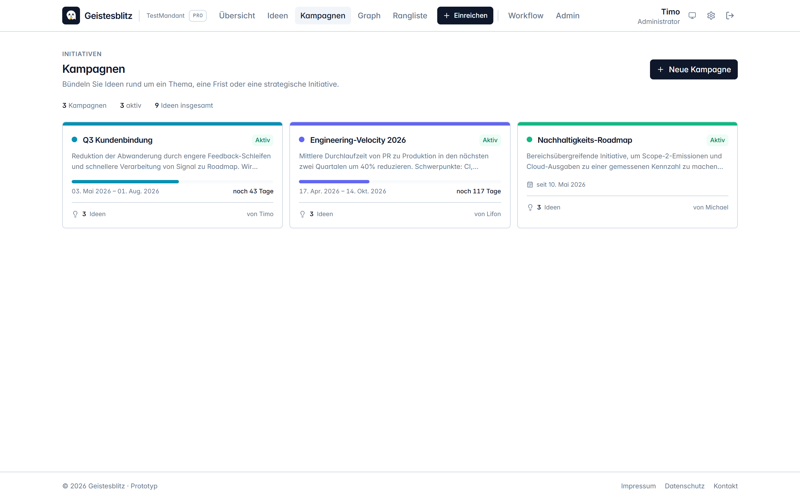 | 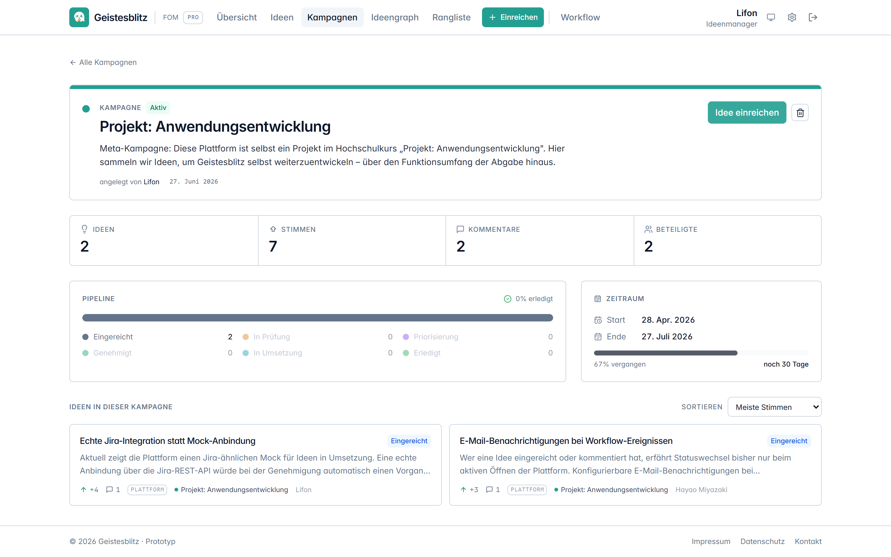 |

### Leaderboard
Ranks the highest-priority ideas and the most active contributors in the tenant — submissions, votes cast, comments, evaluations. Sourced from `/api/leaderboard`.

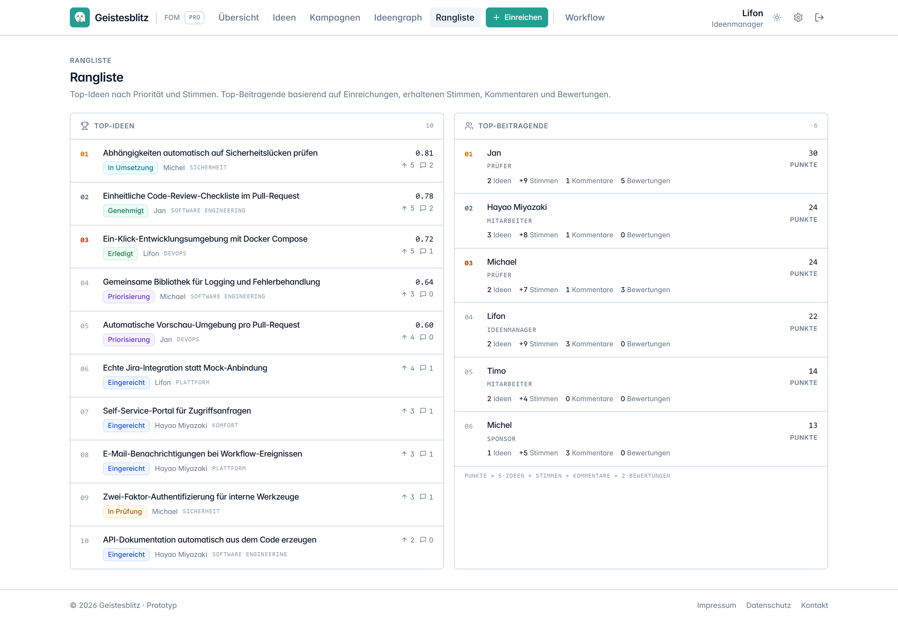
*Leaderboard — top-ranked ideas and the most active contributors.*

### German-only content
- The platform is **German-only**. The UI chrome and all seed content are German; the canonical `title` / `description` / `name` columns hold the German text directly.
- There is **no i18n layer**. The former `*_de` translation columns, the `LocaleFilter` / `LocaleContext` request plumbing, the `X-Content-Lang` header and the `Settings` language toggle were all removed. Migrations `V7`/`V10` still build the German seed; `V15` drops the now-redundant `_de` columns. Full-text search uses the Postgres `german` configuration.

### Theme: dark mode
- Class-based Tailwind dark mode (`dark` on `<html>`).
- Flash-free init script in `index.html` reads `localStorage` before the React bundle mounts, so the first paint matches the user's preference.
- Toggle (`Hell` / `Dunkel` / `Automatisch`) lives at the bottom of the `Settings` page, plus a quick-cycle button in the top bar.

| Dashboard (dark) | Idea list (dark) |
|------------------|------------------|
| 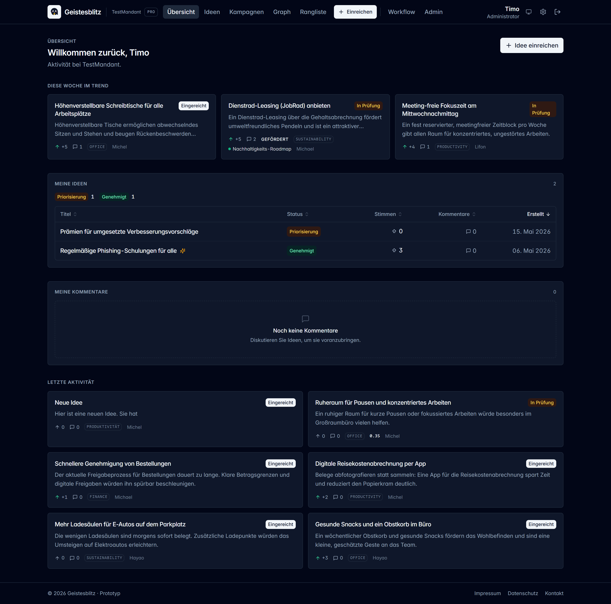 | 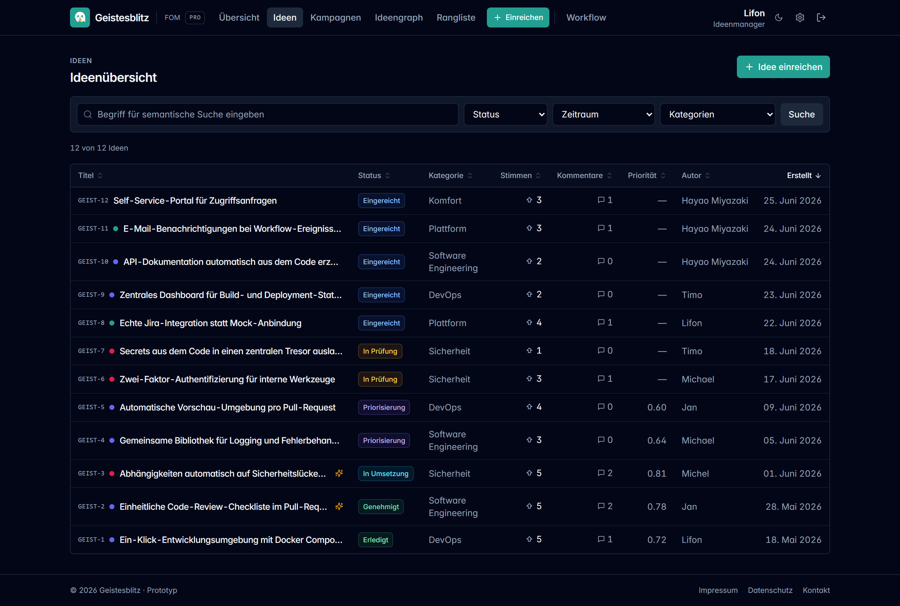 |

### Licensing (server-side enforcement)
| Plan           | Seats     | Ideas / month | RAG refine | Custom workflow | SSO | Price (demo) |
|----------------|-----------|---------------|-----------|-----------------|------|--------------|
| **Free**       | 10        | 30            | ✗         | ✗               | ✗    | €0           |
| **Pro**        | 100       | unlimited     | ✓         | ✗               | ✓    | €9 / seat    |
| **Enterprise** | unlimited | unlimited     | ✓         | ✓               | ✓    | custom       |

Violations return **HTTP 402 Payment Required** with `X-License-Reason` header (`seat_limit_reached`, `idea_quota_reached`, `feature_not_in_plan`, `plan_expired`). The frontend surfaces an upgrade banner.

**Self-service plan upgrade.** The `Settings` page renders the three tiers as cards (price, limits, features) with the active plan flagged. The catalogue (`GET /api/subscription/plans`) is readable by any member; switching plans (`PUT /api/subscription/plan`) is restricted to `ADMIN` / `SUPERADMIN`, so only admins see live "Wechseln" buttons. A switch is immediate (the prototype has no payment step — a real billing integration would gate it), renews the 365-day licence window, unlocks the new plan's features instantly, and refreshes the cached profile so the plan badge updates without a re-login.

| Plan tiers (Settings) | Admin — users & license usage |
|-----------------------|-------------------------------|
| 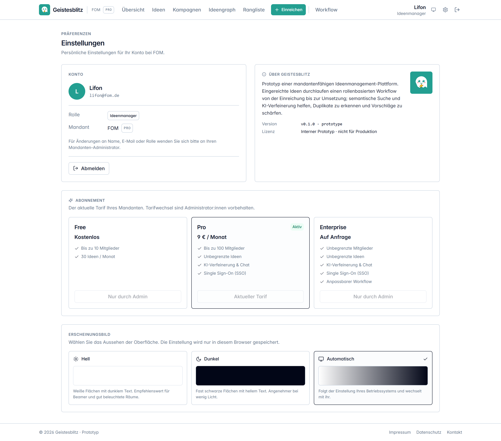 | 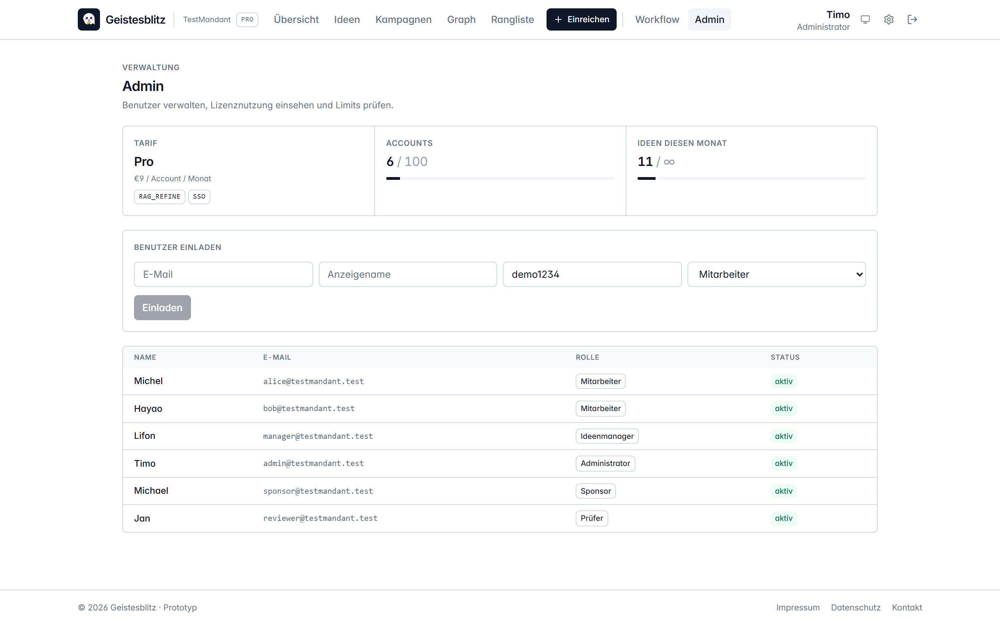 |

### Multi-tenancy & data isolation

One Postgres schema with `tenant_id` on every tenant-owned table. Isolation is enforced in **three layers** so a single forgotten clause can't leak data across tenants:

1. **Request context.** The JWT carries the tenant id; [`JwtAuthFilter`](backend/src/main/java/com/ideaplatform/api/security/JwtAuthFilter.java) puts it into a `TenantContext` ThreadLocal for the request.
2. **ORM filter (application layer).** A Hibernate `tenantFilter` (`tenant_id = :tenantId`) is declared on **every** tenant entity — `Idea`, `User`, `Comment`, `Vote`, `Evaluation`, `Campaign`, `WorkflowHistory` — and [`TenantFilterAspect`](backend/src/main/java/com/ideaplatform/api/tenant/TenantFilterAspect.java) enables it per request. So any JPA query is automatically tenant-scoped without each repository remembering to add the clause. The raw-JDBC vector search ([`JdbcEmbeddingStore`](backend/src/main/java/com/ideaplatform/api/service/embedding/JdbcEmbeddingStore.java)), which bypasses Hibernate, scopes by `tenant_id` explicitly in every statement.
3. **Row-Level Security (database layer, defense-in-depth).** Migration [`V12`](backend/src/main/resources/db/migration/V12__tenant_rls.sql) puts `FORCE ROW LEVEL SECURITY` + a `tenant_isolation` policy on all eight tenant tables. The app publishes the current tenant into the `app.tenant_id` GUC on every pooled-connection borrow via [`TenantAwareDataSource`](backend/src/main/java/com/ideaplatform/api/tenant/TenantAwareDataSource.java); the policy restricts rows to that tenant and is permissive when the GUC is empty (migrations, the on-boot embedding bootstrapper, and the pre-auth login lookup, which run without a tenant in context).

> **Activating the RLS layer.** Superusers bypass RLS unconditionally, and the dev container's role (`geistesblitz`) is a superuser — so in local dev layers 1–2 do the enforcing and RLS is dormant (the policies are installed and ready). In production, run the app as a dedicated **non-superuser** role so RLS actually engages:
> ```sql
> CREATE ROLE app_rls LOGIN PASSWORD '…' NOSUPERUSER NOBYPASSRLS;
> GRANT USAGE ON SCHEMA public TO app_rls;
> GRANT SELECT, INSERT, UPDATE, DELETE ON ALL TABLES IN SCHEMA public TO app_rls;
> GRANT USAGE, SELECT ON ALL SEQUENCES IN SCHEMA public TO app_rls;
> ALTER DEFAULT PRIVILEGES IN SCHEMA public GRANT SELECT, INSERT, UPDATE, DELETE ON TABLES TO app_rls;
> ```
> Point `spring.datasource` at `app_rls` and keep Flyway on the owner role (`spring.flyway.user`) so migrations and `CREATE EXTENSION` still work. `pg_dump` then needs `--enable-row-security` (already set in `scripts/seed-snapshot.sh`).

- Route- and method-level role checks (`@PreAuthorize`, `RequireRole`) gate *actions* on top of the row-level isolation above. Cross-tenant access is reserved for `SUPERADMIN`.

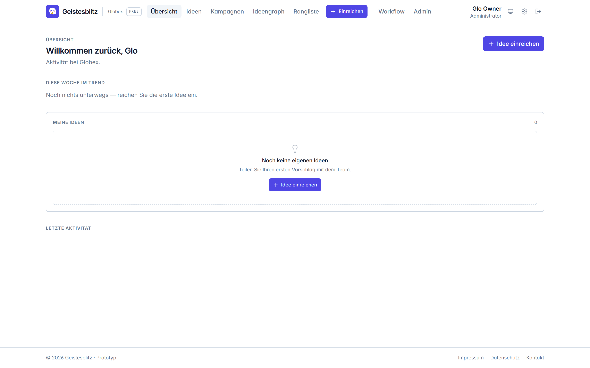
*A second tenant (Globex, Free plan) with its own isolated data — note the tenant badge in the header. Each tenant sees only its own rows.*

### Switchable Postgres ↔ Supabase
Services depend on the [`DataStore`](backend/src/main/java/com/ideaplatform/api/service/datastore/DataStore.java) interface. Two implementations:
- [`JpaDataStore`](backend/src/main/java/com/ideaplatform/api/service/datastore/JpaDataStore.java) — primary, JPA on Postgres (default). Uses `saveAndFlush` on idea creation so the raw-JDBC embedding insert in the same transaction sees the new row's FK target.
- [`SupabaseDataStore`](backend/src/main/java/com/ideaplatform/api/service/datastore/SupabaseDataStore.java) — REST via PostgREST. Activate with `--spring.profiles.active=supabase`.

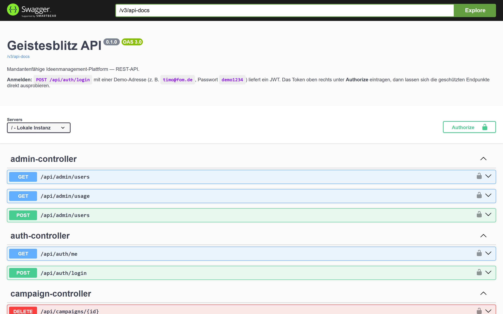
*The REST API surface is identical whichever datastore is active — the `DataStore` abstraction keeps every caller unchanged.*

---

## Run it locally

### Quick start (one command)

On Windows (PowerShell), from the repo root:

```powershell
powershell -ExecutionPolicy Bypass -File scripts\setup.ps1
```

[`scripts/setup.ps1`](scripts/setup.ps1) does the whole bootstrap: checks prerequisites, builds the backend jar, installs frontend dependencies, pulls the `bge-m3` embedding model, starts Postgres + backend + frontend, warms the semantic search, and prints the demo accounts + URLs. It's re-runnable (skips work already done; `-Rebuild` / `-Reinstall` / `-SkipModels` adjust that). When it finishes, open **http://localhost:5173** (API docs at **/swagger-ui.html** on `:8080`).

The manual, cross-platform steps are spelled out below.

### Prerequisites

| Tool             | Version | Why                                                |
|------------------|---------|----------------------------------------------------|
| Java JDK         | 21+     | Backend                                            |
| Maven            | 3.9+    | Backend build (a wrapper is *not* committed)       |
| Node.js          | 20+     | Frontend                                           |
| npm              | 10+     | (ships with Node)                                  |
| Docker / Docker Compose v2 | any   | Postgres + optional containerised Ollama |
| Ollama           | latest  | Embeddings + LLM. Install: <https://ollama.com> (recommended) **or** use the bundled docker-compose service. |

The commands below work on Linux, macOS, and Windows (PowerShell or Git Bash). Run them from the project root after cloning.

### 1. Clone

```bash
git clone <your-repo-url> geistesblitz
cd geistesblitz
```

### 2. Start Postgres

```bash
docker compose -f scripts/docker-compose.yml up -d postgres
```

This pulls `pgvector/pgvector:pg16` and exposes it on `localhost:5432` with credentials `geistesblitz / geistesblitz`. State is persisted to a named volume (`scripts_pgdata`).

### 3. Provide Ollama

Geistesblitz talks to `http://127.0.0.1:11434` for both embeddings and the refine/chat LLM. You have two options:

**Option A — native install (recommended).** Install Ollama from <https://ollama.com>, then:

```bash
ollama pull bge-m3                     # ~1.2 GB, 1024-d multilingual embeddings
ollama pull qwen3.5:2b-q4_K_M         # ~1.5 GB Q4-quantized 2B chat — fits in low-VRAM laptops
```

The default chat model is the Q4 quantized variant for speed on low-VRAM machines. Refine calls pass `"think": false` to Qwen so its reasoning-mode tokens don't eat the `num_predict` budget.

**Option B — bundled docker-compose service:**

```bash
docker compose -f scripts/docker-compose.yml up -d ollama
```

The container pulls the two models on first start. This takes several minutes (and a few GB of disk).

> ⚠️ **Port-collision gotcha.** If you have a native Ollama running, it binds `127.0.0.1:11434` and the docker-compose service binds only IPv6 — so the backend's `WebClient` will hit the *native* daemon. Make sure whichever daemon owns `127.0.0.1:11434` (check with `ollama list`) has the two models pulled. To switch the chat model, edit `ideaplatform.embedding.ollama.chat-model` in [`backend/src/main/resources/application.yml`](backend/src/main/resources/application.yml).

### 4. Backend

```bash
cd backend
mvn spring-boot:run
```

On boot, Flyway runs the migrations (`V1` schema → `V22`; highlights: `V5` campaigns, `V7`+`V10` build the German seed, `V8` Supabase RPCs, `V9` excludes private stages from search, `V12` adds tenant Row-Level Security, `V13` renames the ideamanager role, `V14` renames the demo e-mails, `V15` drops the i18n columns, `V17` curates the ten demo ideas, `V20` adds per-tenant branding (FOM teal), `V21` adds the reviewer/idea-manager assignment pipeline, `V22` adds the per-tenant idea reference key). Afterwards, two ordered `CommandLineRunner`s fire: one resets the seven demo passwords to `demo1234` (so the seeded BCrypt hashes never go stale), and one — the **`EmbeddingBootstrapper`** — generates embeddings for any idea that doesn't have one yet, so semantic search and the graph work on a fresh clone without a manual reindex. It's idempotent (normal restarts do nothing) and non-fatal (if the provider is down it logs and the app still starts). The API binds on `http://localhost:8080`.

#### Run the backend durably (optional)

`mvn spring-boot:run` is fine for active development but dies when the terminal closes or the machine sleeps. For demos, run it as a self-restarting background service instead — no admin rights required:

```powershell
# Build the runnable jar once, then install the auto-restart supervisor
mvn -f backend/pom.xml -DskipTests package
powershell -ExecutionPolicy Bypass -File scripts/install-backend-service.ps1
```

This drops a launcher in your **Startup folder** (so it auto-starts at every logon) and starts [`scripts/run-backend.ps1`](scripts/run-backend.ps1), a supervisor that keeps `target/ideaplatform-api-*.jar` alive and **restarts it within seconds if it ever exits**. Management:

```powershell
Get-Content backend/backend.log -Tail 40                              # logs
powershell -ExecutionPolicy Bypass -File scripts/uninstall-backend-service.ps1   # stop + remove
```

After changing backend code, rebuild the jar (`mvn -f backend/pom.xml -DskipTests package`) — the supervisor picks up the new jar on its next restart. For a system-level service that runs even when logged out, register a scheduled task from an **elevated** shell (`Register-ScheduledTask`); the no-admin Startup approach above is the default.

The frontend (Vite dev server on :5173) has matching scripts for the same auto-restart + logon-start behaviour: `scripts/install-frontend-service.ps1`, [`scripts/run-frontend.ps1`](scripts/run-frontend.ps1), and `scripts/uninstall-frontend-service.ps1` (logs to `frontend/frontend.log`).

### 5. Frontend

In a second terminal:

```bash
cd frontend
npm install
npm run dev
```

Vite serves on <http://localhost:5173> and proxies `/api/*` to the backend. Open the URL in any modern browser.

### 6. Demo accounts

All seeded users share password `demo1234`.

| Email             | Tenant        | Role           |
|-------------------|---------------|----------------|
| lifon@fom.de      | FOM (Pro)     | `IDEA_MANAGER` |
| jan@fom.de        | FOM (Pro)     | `REVIEWER`     |
| michael@fom.de    | FOM (Pro)     | `REVIEWER`     |
| michel@fom.de     | FOM (Pro)     | `SPONSOR`      |
| timo@fom.de       | FOM (Pro)     | `EMPLOYEE`     |
| miyazaki@fom.de   | FOM (Pro)     | `EMPLOYEE`     |
| owner@globex.test | Globex (Free) | `ADMIN`        |

> This is the **curated demo state** — what the committed snapshot (`scripts/seeds/seed.sql`) restores and what the screenshots show. FOM has no `ADMIN` account; demo the Admin area and plan switching as `owner@globex.test`. A plain-migrations setup seeds an older role layout from `V3` — run `scripts/seed-restore.sh` (or `scripts\demo-prep.ps1 -Reset`) to get exactly the state above.

Each tenant carries a **brand colour** (`tenants.brand_color`) that the frontend applies to the app's `--primary` on login, so the whole colour scheme follows the signed-in tenant — **FOM** is teal `#239F91`, **Globex** is indigo `#4f46e5`. The login page keeps the fixed FOM brand.

| FOM (teal) | Globex (indigo) |
|------------|-----------------|
|  |  |

*Same app, tenant-dependent colour scheme — and fully isolated data (Globex sees none of FOM's ideas).*

The login page has a one-click picker for these accounts and defaults to `lifon@fom.de`.

> **Giving a demo?** [`docs/DEMO.md`](docs/DEMO.md) is a timed ~10-minute run-of-show, and
> `scripts\demo-prep.ps1` gets every service up and pre-warms the semantic search in one command
> (`-Reset` restores the clean seed state between rehearsals).

### 7. Embeddings are indexed automatically

You don't need to do anything. On boot the **`EmbeddingBootstrapper`** (step 4) embeds every seeded idea that lacks a vector, so the "similar ideas" sidebar, free-text search, and the graph all work as soon as the backend is up — provided Ollama is reachable. If Ollama was down at boot, just restart the backend once it's healthy and the bootstrapper backfills the gap (it only touches ideas with no embedding).

### 8. (Optional) Identical seed data for everyone

Two ways to give every teammate the same starting dataset:

- **Migrations + auto-embed (default, version-controlled).** Just clone → migrate → run, as above. The migrations recreate the schema + curated German content; the bootstrapper fills in vectors. No binary blobs in git, model-agnostic.
- **Snapshot restore (fast, no Ollama needed).** `scripts/seed-snapshot.sh` dumps the live DB — **including the embedding vectors** — to `scripts/seeds/seed.sql`; `scripts/seed-restore.sh` loads it into a fresh DB. Restores a fully working semantic-search/graph demo in seconds even without an embedding model, at the cost of baking in volatile data (votes, timestamps) and tying the vectors to the model that produced them.

### 9. (Dev) God-mode data console

A hidden in-app data editor for shaping a demo quickly — browse any table, then edit / add / delete rows through a form. It talks to the DB through a raw `JdbcTemplate`, so it **bypasses tenant isolation**: you see and change every tenant's rows.

- **Open it** at [`/dev`](http://localhost:5173/dev) — it is intentionally not linked in the navigation. Any logged-in user can reach it while the flag below is on.
- **Backend:** [`DevDataController`](backend/src/main/java/com/ideaplatform/api/controller/DevDataController.java) exposes `/api/dev/data/**`. Table and column names are validated against `information_schema`; values are bound as parameters and cast to each column's type. `flyway_schema_history` and `idea_embeddings` are hidden.
- **⚠️ Dev/demo only.** Gated behind `ideaplatform.dev.data-console.enabled` (default **`false`**; set to `true` in `application.yml` for local demos). When off, every `/api/dev/data/**` route returns 404. **Set it to `false` in any production build.**

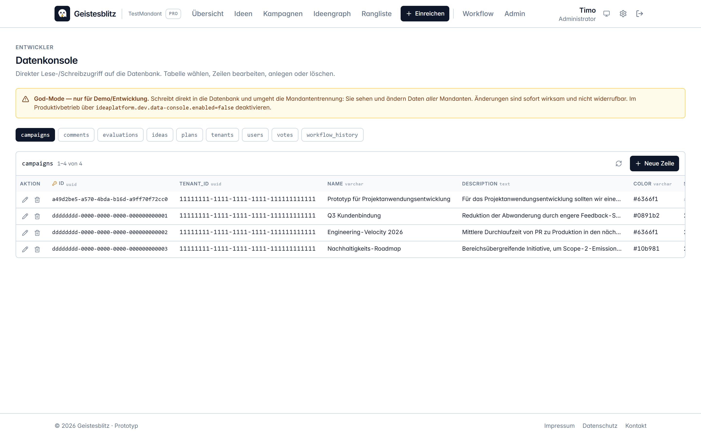
*The hidden `/dev` data console — browse and edit any table across tenants (dev/demo only).*

---

## Switching to Supabase

There are two switchover paths. **Pick Path A unless you have a hard reason to avoid JDBC.**

### Path A — JDBC to Supabase Postgres (recommended)

Supabase is just Postgres + pgvector under the hood, so pointing the existing JDBC datasource at Supabase's connection pooler keeps every feature working — JPA, Flyway, raw pgvector queries, transactions, the lot. **No Java changes; switching is two env vars and a profile flag.**

```bash
# One-time bootstrap (enables pgvector + runs all Flyway migrations)
export SUPABASE_HOST=db.<project-ref>.supabase.co
export SUPABASE_DB_PASSWORD=...
bash scripts/supabase-bootstrap.sh   # enables pgvector + runs all Flyway migrations

# Run the backend against Supabase
cd backend
mvn spring-boot:run -Dspring-boot.run.profiles=supabase-jdbc
```

The profile is committed at [`backend/src/main/resources/application-supabase-jdbc.yml`](backend/src/main/resources/application-supabase-jdbc.yml) — no `.example` copy step needed. It reads the same `SUPABASE_HOST` / `SUPABASE_DB_PASSWORD` env vars at runtime.

### Path B — PostgREST (no direct JDBC)

Use this only when your deployment can't open a direct Postgres connection (edge runtime, hardened egress). It routes all CRUD through PostgREST (`SupabaseDataStore`) and all vector search through Postgres RPC functions (`SupabaseRpcEmbeddingStore`) defined in [`V8__supabase_rpc.sql`](backend/src/main/resources/db/migration/V8__supabase_rpc.sql).

```bash
# Bootstrap first (same script — it applies every migration to Supabase regardless of profile)
bash scripts/supabase-bootstrap.sh

# Configure + run
cp backend/src/main/resources/application-supabase.yml.example \
   backend/src/main/resources/application-supabase.yml
export SUPABASE_URL=https://<project-ref>.supabase.co
export SUPABASE_SERVICE_ROLE_KEY=...
cd backend
mvn spring-boot:run -Dspring-boot.run.profiles=supabase
```

Path B has one known limitation: `netVotes` and `countActiveUsers` fall back to per-row sums in Java because PostgREST has no SQL aggregates by default. Fine for the prototype; replace with an SQL function in production.

### How the switch stays minimal

Every persistence call in the service layer goes through one of two interfaces:

| Interface | JPA implementation | Supabase implementation |
|-----------|--------------------|------------------------|
| [`DataStore`](backend/src/main/java/com/ideaplatform/api/service/datastore/DataStore.java) | `JpaDataStore` (Spring Data JPA) | `SupabaseDataStore` (PostgREST) |
| [`EmbeddingStore`](backend/src/main/java/com/ideaplatform/api/service/embedding/EmbeddingStore.java) | `JdbcEmbeddingStore` (raw JDBC + pgvector) | `SupabaseRpcEmbeddingStore` (PostgREST RPC) |

Both pairs are `@ConditionalOnProperty`-selected via `ideaplatform.datastore.impl` (`jpa` \| `supabase`) and `ideaplatform.embedding.store` (`jdbc` \| `supabase`). The profile files set those — application code never imports a concrete implementation.

---

## Configuration reference

The only files you should normally touch:

| File                                             | What lives there                                   |
|--------------------------------------------------|----------------------------------------------------|
| `backend/src/main/resources/application.yml`     | JWT secret, scoring weights, RAG knobs, Ollama URL/models, OpenAI fallback |
| `backend/src/main/resources/application-postgres.yml` | Postgres JDBC URL / credentials               |
| `backend/src/main/resources/application-supabase.yml` | (You create this from the `.example` file)    |
| `scripts/docker-compose.yml`                     | Postgres + optional Ollama container config        |
| `frontend/vite.config.ts`                        | Dev server port and API proxy target               |
| `frontend/tailwind.config.js`                    | `darkMode: 'class'` + token palette                |

Notable `ideaplatform.*` knobs in `application.yml`:

| Key                                              | Default                       | Purpose |
|--------------------------------------------------|-------------------------------|---------|
| `embedding.provider`                             | `ollama`                      | `ollama` \| `openai` \| `mock` |
| `embedding.dimensions`                           | `1024`                        | Must match pgvector column (`bge-m3`=1024, `nomic`=768, OpenAI 3-small=1536) |
| `embedding.ollama.chat-model`                    | `qwen3.5:2b-q4_K_M`           | Switch to a larger model on machines with more VRAM |
| `scoring.weight-*`                               | 0.40 / 0.35 / 0.15 / 0.10     | Votes / reviewer / recency / sponsor — must sum to 1 |
| `scoring.recency-half-life-days`                 | `30`                          | Half-life for the recency decay term |
| `rag.top-k`                                      | `5`                           | Neighbours pulled for similar / refine / chat context |
| `rag.similarity-threshold`                       | `0.45`                        | Sidebar threshold (free-text search uses `0.30` internally) |
| `dev.data-console.enabled`                       | `false`                       | Exposes the hidden god-mode data editor at `/dev` (`/api/dev/data/**`). Dev/demo only — keep `false` in production |

Environment variables consumed by `application.yml`:

| Var                  | When                                              |
|----------------------|---------------------------------------------------|
| `OPENAI_API_KEY`     | Only if you set `ideaplatform.embedding.provider=openai` |

---

## API cheat-sheet

**Interactive docs:** the backend serves an OpenAPI 3 spec + **Swagger UI** at
**http://localhost:8080/swagger-ui.html** (raw spec at `/v3/api-docs`, YAML at `/v3/api-docs.yaml`).
Click **Authorize**, paste a token from `POST /api/auth/login`, and try any endpoint live.


| Method | Path                                       | Purpose                                   |
|-------:|--------------------------------------------|-------------------------------------------|
| POST   | `/api/auth/login`                          | Exchange email+password for a JWT         |
| GET    | `/api/auth/me`                             | Current user + tenant + plan              |
| GET    | `/api/ideas?stage=SUBMITTED`               | List ideas (optional stage filter)        |
| POST   | `/api/ideas`                               | Create idea (accepts `campaignId`, `preferredReviewerId`, `preferredManagerId`) |
| GET    | `/api/ideas/{id}`                          | Single idea                               |
| PATCH  | `/api/ideas/{id}`                          | Edit idea (re-embeds)                     |
| GET    | `/api/ideas/graph?threshold=0.55`          | Nodes + edges for the semantic graph      |
| POST   | `/api/ideas/{id}/votes`                    | `{ "value": 1 \| -1 \| 0 }`               |
| GET    | `/api/ideas/{id}/comments`                 | List comments                             |
| POST   | `/api/ideas/{id}/comments`                 | Add comment                               |
| POST   | `/api/ideas/{id}/evaluations`              | Reviewer score `{ impact, feasibility, strategicFit, notes }` |
| GET    | `/api/ideas/{id}/evaluations`              | List evaluations on this idea             |
| POST   | `/api/ideas/{id}/transitions`              | `{ "to": "PRIORITIZATION", "reason": "" }` |
| PATCH  | `/api/ideas/{id}/sponsor-boost?on=true`    | Sponsor / Admin only                      |
| GET    | `/api/ideas/assignable-users`              | Users who can fill the reviewer / idea-manager slots |
| GET    | `/api/ideas/my-tasks`                      | Caller's task board (assigned + suggested ideas) |
| PATCH  | `/api/ideas/{id}/assignment`               | Set/clear reviewer + idea manager (manager / admin) |
| POST   | `/api/ideas/{id}/claim?as=reviewer`        | Claim an open slot yourself (`reviewer` \| `manager`) |
| GET    | `/api/ideas/{id}/similar`                  | Top-k semantic neighbours                 |
| POST   | `/api/ideas/{id}/refine`                   | RAG + LLM refinement (requires `rag_refine`) |
| POST   | `/api/ideas/{id}/chat`                     | Multi-turn follow-up on the same idea (requires `rag_refine`) |
| GET    | `/api/campaigns`                           | List tenant's campaigns                   |
| GET    | `/api/campaigns/{id}`                      | Campaign details + linked ideas           |
| POST   | `/api/campaigns`                           | `IDEA_MANAGER` / `ADMIN` only       |
| PATCH  | `/api/campaigns/{id}`                      | Update campaign (manager / admin)         |
| DELETE | `/api/campaigns/{id}`                      | Delete (linked ideas get `campaign_id=NULL`) |
| GET    | `/api/leaderboard`                         | Top ideas + top contributors              |
| GET    | `/api/search?q=...`                        | Free-text semantic search (uses `search_query:` prefix) |
| GET    | `/api/workflow/stages`                     | Stage transition map                      |
| GET    | `/api/workflow/history/{ideaId}`           | Audit trail of transitions                |
| GET    | `/api/admin/users`                         | List tenant users                         |
| GET    | `/api/admin/usage`                         | Plan, seats used, ideas this month        |
| POST   | `/api/admin/users`                         | Invite a user (enforces seat cap)         |
| GET    | `/api/subscription/plans`                  | Plan catalogue, current plan flagged (any member) |
| PUT    | `/api/subscription/plan`                   | Change tenant plan `{ "planCode": "PRO" }` (`ADMIN` / `SUPERADMIN`) |

All routes except `/api/auth/login`, `/actuator/health`, `/actuator/info` require a `Bearer` JWT.

---

## Repository layout

```
geistesblitz/
├── backend/
│   └── src/main/java/com/ideaplatform/api/
│       ├── config/        Exception handler, demo password resetter, embedding bootstrapper
│       ├── controller/    Auth, Idea, Campaign, Leaderboard, Search, Workflow, Admin, Subscription, DevData (flag-gated)
│       ├── domain/        JPA entities + enums
│       ├── dto/           Request/response records
│       ├── license/       LicenseService, @RequiresFeature aspect
│       ├── repo/          Spring Data repositories
│       ├── security/      JwtService, JwtAuthFilter, MockKeycloakAdapter
│       ├── service/       Idea, Vote, Evaluation, Comment, Workflow, Scoring,
│       │   │              Campaign, Leaderboard, Recommendation, Refine
│       │   ├── datastore/ DataStore interface + JpaDataStore + SupabaseDataStore
│       │   └── embedding/ EmbeddingProvider + Ollama / OpenAI / Mock
│       ├── tenant/        TenantContext + servlet filter (tenant scoping)
│       └── workflow/      IdeaWorkflow state machine
│   └── src/main/resources/db/migration/   V1..V22 (V5 campaigns, V7 i18n seed, V8 Supabase RPC, V9 search visibility, V10 German-canonical, V11 1024-d embeddings, V12 tenant RLS, V13 ideamanager role, V14 demo emails, V15 drop i18n, V16 drop draft stage, V17 curate ten ideas, V18 themed campaigns, V19 meta campaign, V20 tenant branding, V21 idea assignment, V22 idea reference)
├── frontend/
│   └── src/
│       ├── api/           Axios client (refreshes /auth/me) + endpoint wrappers
│       ├── components/    Layout (top nav bar), IdeaCard, StageBadge, RoleGate, Spinner, ui/ (shadcn-style primitives)
│       ├── lib/           permissions, campaign helpers, jira/reference helpers, tenant theming, cn()
│       ├── pages/         Dashboard (task board + own ideas), IdeaList (filterable table),
│       │                  IdeaDetail, IdeaGraph, Leaderboard, Campaigns, CampaignDetail,
│       │                  SubmitIdea, Workflow (Kanban board), MockJira (delivery hand-off),
│       │                  Settings, Admin, DevData (hidden /dev), Login, Impressum, Datenschutz
│       ├── store/         Zustand: auth, theme (all persisted)
│       └── types/         API DTO types
├── docs/                  Architecture/workflow/licensing deep-dives, demo run-of-show, screenshot gallery
└── scripts/               docker-compose and dev helpers
```

The Java package is still `com.ideaplatform.api` for historical reasons; this is a cosmetic detail and can be refactored to `com.geistesblitz.api` if desired.

---

## Tests

A focused backend suite covers the security- and correctness-critical logic with no database or Ollama needed (unit / service-layer tests with a mocked `DataStore`, ~1.5 s):

```bash
mvn -f backend/pom.xml test
```

| Test class | Covers |
|------------|--------|
| `IdeaWorkflowTest` | Role-gated stage machine — who may make each transition (incl. `IDEA_MANAGER`), the `SUPERADMIN` override, illegal stage jumps, archiving |
| `JwtServiceTest` | JWT issue/verify round-trip + rejection of tampered / expired / wrong-issuer tokens, and the introspection contract the auth filter relies on |
| `IdeaServiceTest` | Tenant isolation (cross-tenant access → 404) and idea listing |

The durable-jar build uses `-DskipTests` for speed; run `mvn test` (or `mvn verify`) to execute the suite.

---

## Troubleshooting

- **Backend won't start, complains about schema validation** — your local DB is on a stale Flyway version. Easiest reset:
  ```bash
  docker compose -f scripts/docker-compose.yml down -v
  docker compose -f scripts/docker-compose.yml up -d postgres
  ```
- **Ollama returns 404 from the backend, even though `curl` works** — confirm `ollama list` shows `bge-m3` on the same `127.0.0.1:11434` daemon the backend is calling. See the "Port-collision gotcha" above.
- **Semantic search returns no / the same 1–2 unrelated results for every query** — either Ollama was down when the ideas were indexed (restart the backend with Ollama healthy; the `EmbeddingBootstrapper` backfills any missing vectors), or embeddings were stored without the `search_document: ` prefix by an older build (re-embed by `PATCH`-ing the affected ideas, which re-runs them through the service layer).
- **AI refine takes 30+ seconds and produces only a single sentence** — you're on a Qwen reasoning model without `think: false`. The default `qwen3.5:2b-q4_K_M` plus the existing `"think": false` flag and `num_predict: 256` cap keeps a refine call under ~5–10 s on a CPU-only laptop.
- **`Embedding indexing failed`** in backend logs — RAG is best-effort; the idea is saved either way. Once Ollama is healthy, restart the backend and the `EmbeddingBootstrapper` re-indexes anything still missing a vector.
- **Login returns 401** — the demo password resetter only fires under the `postgres` profile. Either run with that profile (the default) or set `ideaplatform.demo.reset-passwords: false` and seed your own hashes.
- **`403 Forbidden` on `/api/auth/login` itself** — you posted to `/auth/login` instead of `/api/auth/login`. Spring Security's request matcher only opens the `/api/auth/**` prefix.
- **Pages render blank after a long idle** — your JWT TTL (480 min) expired. Clear `localStorage` and re-login.

---

## Known limitations / next steps

- **Integration tests** — a focused unit/service suite already exists (see [Tests](#tests)); the natural next step is Testcontainers-backed integration tests against a real Postgres, plus a frontend/E2E layer.
- **Idea delete endpoint** — not yet exposed (neither `DataStore` nor `IdeaController` implement it).
- **List endpoints do per-idea queries** — `GET /api/ideas` resolves votes, comment/evaluation counts, campaign and assignee names per idea (N+1). Harmless at demo scale; batching the aggregates is the next optimization.
- **Reference numbering under concurrency** — the `MAX(reference)+1` assignment can race on simultaneous creates; the unique index rejects the loser instead of retrying.
- **Plan upgrade has no payment step** — `PUT /api/subscription/plan` switches the tenant immediately. A production build would gate it behind a billing provider (Stripe etc.) and a webhook.
- **Supabase datastore** — functionally complete but uses per-row sums instead of PostgREST RPCs for `netVotes`. Fine for the prototype; replace with a stored function in production.
- **`AdminService` duplicate-email check** queries globally, which leaks "email exists" across tenants. Switch to `findByEmailAndTenantId`.
- **Campaigns** — no UI to detach an idea from a campaign after the fact (the FE select on Submit only sets the value; `PATCH /api/ideas/{id}` with `campaignId: null` is currently a no-op because the service guards on `!= null`).
- **Seed snapshot in git** — `scripts/seeds/seed.sql` is a generated dump (incl. vectors, currently ~230 KB) committed for the fast-restore path. Teams that prefer to keep large generated SQL out of version control can `.gitignore` it and regenerate via `scripts/seed-snapshot.sh`.
- **Legal pages are templates** — the German footer links to public `/impressum` and `/datenschutz` (DSGVO) pages; contact is `lifon.chun@gmail.com`. The `[ … ]` placeholders (Name, Anschrift) and the Datenschutz wording must be completed and legally reviewed before any public deployment.

| Impressum | Datenschutz |
|-----------|-------------|
| 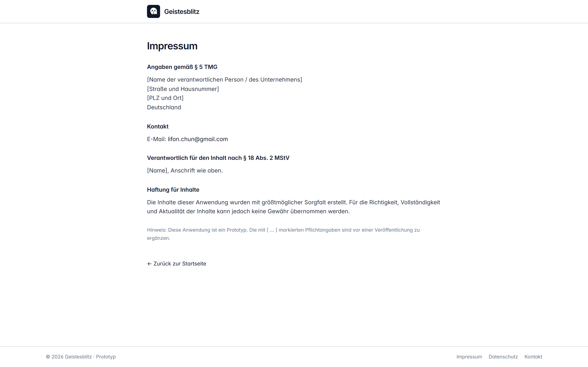 | 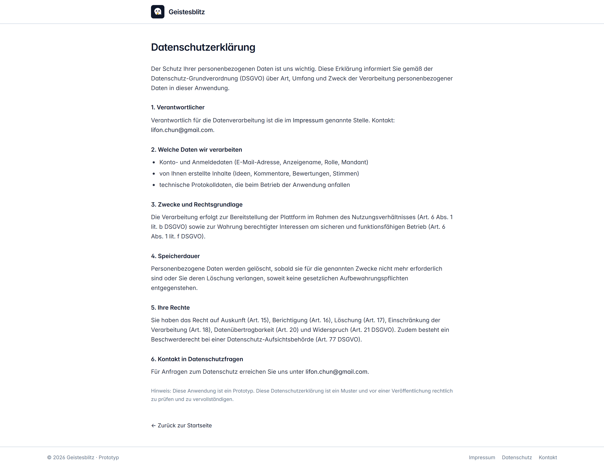 |

---

## License & attribution

Prototype, not licensed for production use without your own security review (real Keycloak/OIDC, proper secrets management, real LLM provider credentials, hardened CORS, audit logging, rate limits).
